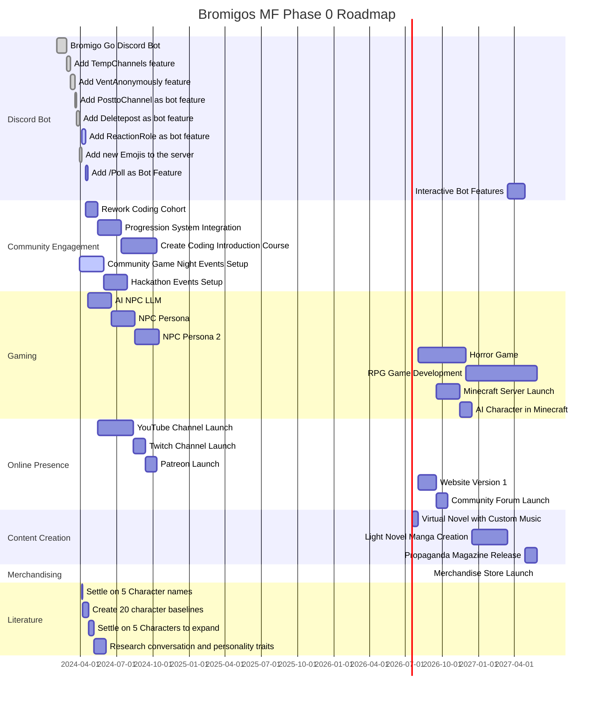

## Welcome Bromigo

We are on a mission to create a Multimedia Interactive Franchise. Here you can see our public roadmaps and phases that are subject to change any time and you will see the updates live here.

### Bromigos MF Phase 0 Roadmap

The Bromigos MF Phase 0 Roadmap outlines the initial phase in the development of the Bromigos interactive multimedia franchise. This roadmap focuses on establishing a strong community engagement foundation, developing initial gaming projects, expanding online presence, creating engaging content, initiating merchandising efforts, and starting literature projects.

#### Discord Bot

- Bromigo Go Discord Bot: The foundation of our interactive community engagement tools, providing essential functionality to our Discord server.
- Add TempChannels Feature: Allows users to create temporary channels for specific conversations, enhancing user interaction.
- Add VentAnonymously Feature: Enables users to share their thoughts anonymously, fostering a supportive community environment.
- Add PosttoChannel as Bot Feature: Allows admins to post messages in any channel as the bot, improving communication flexibility.
- Add Deletepost as Bot Feature (Active): Lets moderator request the deletion of a number of posts via the bot, adding a layer of privacy and control.
- Add ReactionRole as Bot Feature: Enables role assignment through reactions to messages, simplifying user role management.
- Interactive Bot Features: To be developed, aiming to make interactions more engaging and immersive within the Discord community.

#### Community Engagement

- Rework Coding Cohort: Revamping our coding cohort system to provide more structured and beneficial learning experiences.
- Progression System Integration: Introducing a progression system to visually track and reward community members' growth and contributions.
- Create Coding Introduction Course: Developing an introductory coding course to welcome and educate newcomers to the coding community.
- Community Game Night Events Setup: Organizing regular game night events to foster community engagement and provide entertainment.
  Hackathon Events Setup: Setting up hackathon events to encourage innovation, collaboration, and skill development within the community.

#### Gaming

- Text-Based Games: Development of immersive text-based games to introduce the community to the Bromigos universe.
- Horror Game: A thrilling horror game project to diversify our gaming portfolio and engage fans of the genre.
- RPG Game Development: Creating an RPG that encapsulates the essence of the Bromigos universe, offering depth, story, and character development.
- Minecraft Server Launch: Establishing a Minecraft server themed around the Bromigos universe, enhancing the immersive experience.
- AI Character in Minecraft: Integrating an AI character from previous games into the Minecraft server, connecting various elements of the Bromigos universe.

#### Online Presence

- YouTube & Twitch Channel Launch: Starting YouTube and Twitch channels to share content, updates, and live streams with our community.
- Patreon Launch: Launching a Patreon to offer exclusive content and perks to supporters, helping fund further developments.
- Website Version 1: Rolling out the first version of our website, serving as a central hub for all things Bromigos.
- Community Forum Launch: Launching a forum on our website to provide a space for discussions, feedback, and community building.

#### Content Creation

- Virtual Novel with Custom Music: Developing a virtual novel with custom music to tell captivating stories within the Bromigos universe.
- Light Novel Manga Creation: Collaborating with artists to create a light novel manga, expanding our storytelling mediums.
- Propaganda Magazine Release: Releasing a propaganda-style magazine to creatively share news, stories, and updates from the Bromigos universe.

#### Merchandising

- Merchandise Store Launch: Opening an online store to offer Bromigos-themed merchandise, allowing fans to own a piece of the universe.

#### Literature

- Settle on 5 Character Names (Active): Finalizing the names of key characters in the Bromigos universe to maintain consistency and identity.
- Create 20 Character Baselines: Developing detailed character profiles to guide their development and interactions within the universe.
- Settle on 5 Characters to Expand: Selecting characters with potential for further exploration and expansion in future projects.
- Research Conversation and Personality Traits: Studying various conversation and personality traits to enhance character depth and authenticity.
