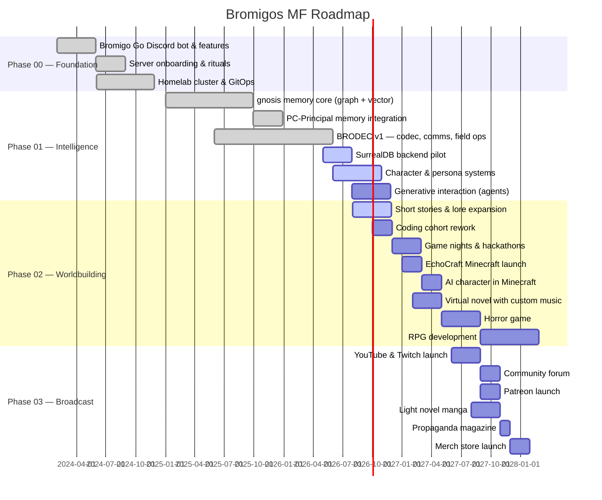

## Welcome, Bromigo

**One network. Every world.** We are on a mission to build a Multimedia Interactive Franchise — community tools, memory-aware AI, games, and fiction that all connect back to one universe. Everything is built in public: the roadmaps below are live, subject to change at any time, and updated right here.

**⌁ Command hub:** [bromigos.org](https://bromigos.org) · **⌁ Discord:** [join the network](https://discord.gg/Evd5RhWKH) · **⌁ Field comms:** [brodec.ai](https://brodec.ai)

### Active operations

| Operation | Role | Status |
|---|---|---|
| [BRODEC](https://brodec.ai) | Retro-codec tactical comms game — AI specialists, squad calls, geofenced field ops | 🟢 LIVE |
| [PC-Principal](https://github.com/bromigos-org/PC-Principal) | The Bromigos Discord agent — memory-aware conversations, moderation helpers, event capture | 🟢 LIVE |
| [gnosis](https://github.com/bromigos-org/gnosis) | Self-hosted memory core for AI agents — Neo4j graph/vector store behind an authenticated gateway | 🟢 ACTIVE |
| homelab | Infrastructure — local cluster, GitOps, and the memory stack the agents run on | 🟢 ACTIVE |
| echocraft.net | The Bromigos Minecraft network | 🟡 STAGING |
| [GhostWriter](https://github.com/bromigos-org/GhostWriter) | Unified messaging automation across platforms | 🟡 IN DEV |
| `[REDACTED]` | Horror game · RPG · living stories with custom music | 🔒 CLASSIFIED |

### Mission phases

```mermaid
gantt
    dateFormat  YYYY-MM-DD
    title Bromigos MF Roadmap

    section Phase 00 — Foundation
    Bromigo Go Discord bot & features   :done, p0a, 2024-02-01, 120d
    Server onboarding & rituals         :done, p0b, after p0a, 90d
    Homelab cluster & GitOps            :done, p0c, 2024-06-01, 180d

    section Phase 01 — Intelligence
    gnosis memory core (graph + vector) :done, p1a, 2025-01-01, 270d
    PC-Principal memory integration     :done, p1b, after p1a, 90d
    BRODEC v1 — codec, comms, field ops :done, p1c, 2025-06-01, 365d
    SurrealDB backend pilot             :active, p1d, 2026-05-01, 90d
    Character & persona systems         :active, p1e, 2026-06-01, 150d
    Generative interaction (agents)     :p1f, after p1d, 120d

    section Phase 02 — Worldbuilding
    Short stories & lore expansion      :active, p2a, 2026-08-01, 120d
    Coding cohort rework                :p2b, 2026-10-01, 60d
    Game nights & hackathons            :p2c, after p2b, 90d
    EchoCraft Minecraft launch          :p2d, 2027-01-01, 60d
    AI character in Minecraft           :p2e, after p2d, 60d
    Virtual novel with custom music     :p2f, 2027-02-01, 90d
    Horror game                         :p2g, after p2f, 120d
    RPG development                     :p2h, after p2g, 180d

    section Phase 03 — Broadcast
    YouTube & Twitch launch             :p3a, 2027-06-01, 90d
    Community forum                     :p3b, after p3a, 60d
    Patreon launch                      :p3c, after p3a, 60d
    Light novel manga                   :p3d, 2027-08-01, 90d
    Propaganda magazine                 :p3e, after p3d, 30d
    Merch store launch                  :p3f, after p3e, 60d
```

#### Phase 00 — Foundation ✅ COMPLETE

The community and technical base everything else stands on.

- [x] Bromigo Go Discord bot — TempChannels, VentAnonymously, PostToChannel, DeletePost, ReactionRole
- [x] Server onboarding, custom emojis, and community rituals
- [x] Homelab cluster, GitOps applications, and shared infrastructure

#### Phase 01 — Intelligence 🟡 IN PROGRESS

Memory, context, and generative interaction across the network.

- [x] gnosis — tenant-scoped memory service over a Neo4j graph/vector store with an LLM gateway
- [x] PC-Principal rebuilt as a memory-aware agent talking to gnosis over HTTP
- [x] BRODEC v1 — codec calls with lip-synced AI specialists, squad voice/video, live transcripts, geofenced field missions, and the HQ web command center
- [ ] SurrealDB pilot — measurable evidence for replacing Neo4j as the gnosis backend
- [ ] Character baselines, persona systems, and conversation research
- [ ] Generative AI features surfaced across the bot and games

#### Phase 02 — Worldbuilding 🔜 QUEUED

Stories, games, and an evolving shared canon.

- [ ] Short stories #1 and #2, lore baseline expansion, and the five expanded characters
- [ ] Reworked coding cohort and introduction course
- [ ] Community game nights and hackathon events
- [ ] EchoCraft Minecraft server launch — with an AI character from the canon walking the server
- [ ] Virtual novel with custom music
- [ ] Horror game, then the RPG

#### Phase 03 — Broadcast 📡 LONG RANGE

A home for the fandom.

- [ ] YouTube and Twitch channel launches
- [ ] Community forum on bromigos.org
- [ ] Patreon, light novel manga, propaganda magazine, and the merch store

---

*The making is part of the story. Watch the pieces arrive — or bring something to the table: [contact@bromigos.org](mailto:contact@bromigos.org)*
